# Hands on Machine Learning with Scikit-learn and TensorFlow

标签（空格分隔）： sklearn ml

---

## Part I, The Fundamentals of Machine Learning

### Chapter 1. The Machine Learning Lanscape

 - What is Machine Learning（什么是ML）
 - Why use Machine Learning（为什么使用ML）
 - Types of Machine Learning Systems（ML系统的类型）
    - Supervised/Unsupervised Learning（监督/无监督学习）
        - supervised learning（监督学习-- training data is labeled）:classification（分类） & regression（回归）
            -  k-Nearest Neighbors
            -  Linear Regression
            -  Logistic Regression
            -  Support Vector Machines (SVMs)
            -  Decision Trees and Random Forests
            -  Neural networks2
        - unsupervised learning（无监督学习 -- training data is unlabeled）:Clustering（聚类） & Visualization and dimensionality reduction（可视化和降维） & Association rule learning（关联规则）
            - Clustering（k-Means,  Hierarchical Cluster Analysis (HCA), Expectation Maximization）
            - Visualization and dimensionality reduction(Principal Component Analysis (PCA), Kernel PCA, Locally-Linear Embedding (LLE),  t-distributed Stochastic Neighbor Embedding (t-SNE))
            -  Association rule learning（Apriori, Eclat）
        - semisupervised learning（半监督学习）:a lot of unlabeled data and a little bit of labeled data.
        - Reinforcement Learning（强化学习）:agent observe the environment,select and perform actions,and get rewards in returns.
    - Batch and Online Learning（批量和在线学习）
        - batch learning（批量学习）:不能逐步学习，只能一次性训练全部可用的数据，通常是离线完成。
        - online learning（在线学习）：序列化接收数据训练，高效，廉价，
    - Instance-Based Versus Model-Based Learning（基于实例和基于模型的学习）
        - Instance-based learning（基于实例学习）：判定样本之间的相似程度，类似于 kNN 。
        - Model-based learning（基于模型学习）：根据已有数据集创建模型，然后在新数据集上进行预测。

#### example 1-1 是不是钱（GDP）能够使人们幸福？（单变量回归）

```python
import matplotlib
import matplotlib.pyplot as plt
import numpy as np
import pandas as pd
import sklearn
# Load the data
oecd_bli = pd.read_csv("oecd_bli_2015.csv", thousands=',')
gdp_per_capita = pd.read_csv("gdp_per_capita.csv",thousands=',',delimiter='\t',
 encoding='latin1', na_values="n/a")
# Prepare the data
country_stats = prepare_country_stats(oecd_bli, gdp_per_capita)
X = np.c_[country_stats["GDP per capita"]]
y = np.c_[country_stats["Life satisfaction"]]
# Visualize the data
country_stats.plot(kind='scatter', x="GDP per capita", y='Life satisfaction')
plt.show()
# Select a linear model
lin_reg_model = sklearn.linear_model.LinearRegression()
# Train the model
lin_reg_model.fit(X, y)
# Make a prediction for Cyprus
X_new = [[22587]] # Cyprus' GDP per capita
print(lin_reg_model.predict(X_new)) # outputs [[ 5.96242338]]
```

如果想要使用 基于实例学习的算法，可以使用下面的算法：

```python
clf = sklearn.linear_model.LinearRegression()
替换为：
clf = sklearn.neighbors.KNeighborsRegressor(n_neighbors=3)
```

 - ML 的主要挑战
    - 训练数据量不足
    - 数据的有效性不合理
    - 没有代表性的训练数据
    - 质量很差的数据
    - 不相关的 features
    - 过拟合训练数据集
    - 欠拟合训练数据集

 - Testing and Validating（测试和验证）
 - Exercise（练习题）


### Chapter 2. End-to-End Machine Learning Project

several open data repositories:

 1. Popular open data repositories:
    - UC Irvine Machine Learning Repository(http://archive.ics.uci.edu/ml/index.php)
    - Kaggle datasets(https://www.kaggle.com/datasets)
    - Amazon's AWS datasets(https://aws.amazon.com/fr/datasets/)
 2. Meta portals (they list open data repositories):
    - http://dataportals.org/
    - http://opendatamonitor.eu/
    - http://quandl.com/
 3. Other pages listing many popular open data repositories:
    - Wikipedia’s list of Machine Learning datase(https://goo.gl/SJHN2k)
    - Quora.com question(http://goo.gl/zDR78y)
    - Datasets subredd(https://www.reddit.com/r/datasets/)

main steps you will go through：

#### 2.1、Look at the big picture（从大局考虑）

 - Frame the problem（解决什么问题）
 - Select a Performance Measure（选择一个性能指标）
 - Check the Assumptions（验证我们的假设）

#### 2.2、Get the data

 - Create the Workspace（创建工作区间）
 - Download the Data（下载数据）
 - take a quick look at the Data Structure（简略看一下数据结构）
 - Create a Test Set（创建一个测试数据集）

#### 2.3、Discover and visualize the data to gain insights（发现并可视化数据以获取灵感）

 - 可视化数据中的特征
 - 寻找相关性
 - 试着组合 features 进行实验，观察效果

#### 2.4、Prepare the data for Machine Learning algorithms

 - Data Cleaning
    - 处理缺失值（可以使用 dropna(), drop(), fillna() 方法，sklearn 提供了一个 Imputer 类来方便处理缺失值）
        - drop 相关字段
        - drop 整个 feature
        - 将缺失值用其他值来填充（0,平均值，中位数等）
 - Handling Text and Categorical Attribut（处理文本和类别数据）
    - 使用 sklearn 提供的 LabelEncoder ,将 text 文件转换成为对应的数字类别。
    - 使用 sklearn 提供的 OneHotEncoder ,将类别数据转换成为对应的 N 维数组（只包含 0/1）
    - 使用 sklearn 提供的 LabelBinarizer ,将标签进行转换为二值化（如 yes/no 转化为 1/0）
 - Custom Transformers（自定义转换）
    - 只需要创建一个类，并实现三种方法：
        - fit() 返回 self
        - transform()
        - fit_transform()，这一个方法只需要简单添加 TransformerMixin 作为基类就可以。
        - 如果将 BaseEstimator 作为基类，将获得两个额外的方法（get_params(） 和 set_params()）
 - Feature Scaling（特征缩放）
    - min-max scaling（减去最小值然后除以最大值减去最小值的差值），大多数人叫它 - normalization（正则化），sklearn中是MinMaxScaler 。
    - standardization（标准化）：减去方差，除以方差使得结果分布有单位方差。sklearn中是 StandardScaler 。
 - Transformation Pipelines（转换流水线）
    - sklearn 提供了 Pipeline 类来实现对应的序列化转换。
    - sklearn 中使用 Pipeline 的一个例子

#### 2.5、Select a model and train it

 - Training and Evaluating on the Training Set（在训练数据集上训练并进行评估）
    - 在房价数据集上训练一个 Linear Regression model 的例子
 - Better Evaluation Using Cross-Validation（使用交叉验证进行更好的评估）
    - sklearn 提供了 K-fold cross-validation

#### 2.6、Fine-tune your model（调试好你的模型）

 - Grid Search：使用 sklearn 中的 GridSearchCV 来帮助你，你只需要告诉它你需要实验哪个超参数和这个超参数的测试值。
 - Randomized Search：使用 sklearn 中的 RandomizedSearchCV ，当我们需要 search 的 space 范围超大的时候，可以使用 RandomizedSearchCV ，只需要设置 迭代次数就可以了。
 - Ensemble Methods（集成方法）：比如 RF 比单个 decision tree 效果更好
 - Analyze the Best Models and Their Errors（分析最好模型和误差）：比如  RandomForestRegressor 可以列出每个 feature 的相对重要性，我们根据这些重要性，可以选择 drop 哪些重要性不高的 features 。
 - Evaluate Your System on the Test Set（在测试数据集上进行评估你的系统）：在测试数据集上进行评估模型的准确度。

#### 2.7、Launch, monitor, and maintain your system（启动，监视和维护你的系统）

#### 2.8、Try it Out！（小结）

这个章节已经告诉你，一个 ML project 是什么样的，并且展示了好几种比较好用的 tools 。但是会发现，大多数的任务还是在 data preparation 步骤，创建 监控工具，设置人为的评估 pipeline，并自动化常规模型训练。

#### 2.9、Exercise（训练题）

### Chapter 3、Classification（分类）

#### 3.1、MNIST

在这一章节中，我们将使用 MNIST 的数据集，其中包含了 70000 张手写数字的小图片。每个图片都已经有了 label，代表它是哪个数字。这个数据集被很广泛的使用以至于它被称为机器学习的 "Hello World" 。

#### 3.2、Training a Binary Classifier（训练一个二分分类器）

二分分类器，比如，我们要训练一个区分数字 5 的分类器，这个分类器的工作就是区分：是 5 还是不是 5 。

我们首先使用 Stochastic Gradient Descent (SGD) classifier, 使用的是 sklearn 中的 SGDClassifier 类。

#### 3.3、Performance Measures（性能度量）

 1. Measuring Accuracy Using Cross-Validation（使用交叉验证验证测量准确性）
    - Implementing Cross-Validati（实现交叉验证）：使用 sklearn 的 StratifiedKFold 。如：from sklearn.model_selection import StratifiedKFold
 2. Confusion Matrix（混淆矩阵）：总的思路是要看 数字5 被错分成 3 的次数，就查看混淆矩阵的 5行3列就好了。调用如： from sklearn.metrics import confusion_matrix
 3. Precision and Recall（精确度和召回）：如： from sklearn.metrics import precision_score, recall_score
 4. Precision/Recall Tradeof（精确度/召回 权衡）：提高精确度会降低召回率，而提高召回率会降低精确度。
 5. The ROC Curve（ROC 曲线）：receiver operating characteristic (ROC) curve 与二分分类器一起使用的另一种常用的工具。

#### 3.4、Multiclass Classification

一些算法是针对二分分类的（如：SVM 和一些线性分类器），而另外一些是可以处理多分类的问题的（如：随机森林分类器和朴素贝叶斯分类器）。

 - one-versus-all(OvA) strategy(也叫 one-versus-the-rest)。创建专门针对一个的分类器，比如0-9的分类器，我们创建 10 个分类器。每个分类器针对特定的数字识别。
 - one-versus-one（OvO）strategy。创建 N X (N-1)/2 个分类器，比如0-9的分类器，训练0-1,0-2,1-2 等分类器。

#### 3.5、Error Analysis

有很多种方法，一种推荐的方法是查看 confusion matrix ，首先使用 cross_val_predict() 函数，然后调用 confusion_matrix() 函数。

#### 3.6、Multilabel classification

有时候我们希望我们的分类器能够为每个样本输出多个 labels。比如 人脸识别的分类器，如果在一个图片中有多个人就会出现这样的结果。

sklearn 中比较常用的是 KNN 算法。

#### 3.7、Multioutput Classification

全称是 multioutput-multiclass classification ，是多标签分类的概括，其中每个标签可以是多类的（即它可以有两个以上的可能值）。

例如，我们创建一个从图像中去除噪声的系统。它将输入一个具有多噪声的数字图像，然后输出一个干净的数字图像，表示为一个像素强度的数组，就像MNIST图像一样。 请注意，分类器的输出是多标签（每个像素一个标签），每个标签可以有多个值（像素强度范围从0到255）。 因此，这是一个多输出分类系统的例子。

#### 3.8、Exercise


### Chapter 4、Training Models

#### 4.1、Linear Regression

线性回归的一般形式：

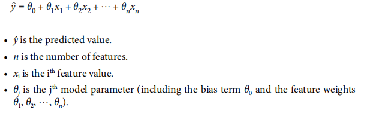

线性回归的向量形式：


衡量线性回归在训练集上拟合效果好坏的 cost function ：

第一种是：

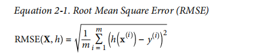

第二种是：

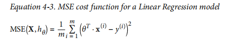

##### 4.1.1、The Normal Equation（正常方程）

求出的回归系数的正常方程：

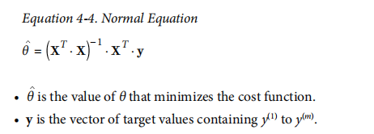

接下来，给出了自己实现的 线性回归 和 sklearn 实现的线性回归的代码。

```python
>>> from sklearn.linear_model import LinearRegression
>>> lin_reg = LinearRegression()
>>> lin_reg.fit(X, y)
>>> lin_reg.intercept_, lin_reg.coef_(array([ 4.21509616]), array([[ 2.77011339]]))>>> lin_reg.predict(X_new)
array([[ 4.21509616], [ 9.75532293]
```

##### 4.1.2、Computational Complexity（计算复杂度）

计算线性回归的回归系数的正常方程的时候，需要计算矩阵的逆，但是求矩阵的逆是个很复杂的计算，如果数据的 features 变多的话，计算就会很慢很慢。下面介绍一个专门针对很多的 features 或者 很多的训练样本的一种 Linear Regression 的方法 —— 梯度下降（Gradient Descent）。


#### 4.2、Gradient Descent

梯度下降的一般思路是迭代地调整参数，以使成本函数最小化。

首先我们用随机值填充 θ （这被称为随机初始化），然后逐渐改进，每次采取一步，每一步都试图降低成本函数（例如，MSE），直到算法收敛到最小。

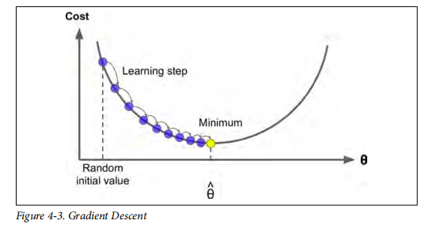

下图显示了梯度下降遇到的 2 个主要问题：

* 如果随机初始化从左边开始，那么它将收敛到局部最小值，不如全局最小值。
* 如果从右边开始，那么跨越 plateau 将需要很长的时间，如果你 stop 的过早，你将永远达不到全局最小值。

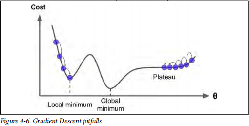

幸运的是，线性回归模型的 MSE 成本函数碰巧是凸函数，这样就意味着没有局部最小值，只有一个全局最小值。并且它还是一个连续的函数，斜率不会突然变化。这两点能保证梯度下降能够接近全局最小值。

还有一点，在使用梯度下降的时候，尽量保证所有的特征拥有相似的量级，（可以使用 sklearn 中的 StandardScaler 类）。

##### 4.2.1、Batch Gradient Descent（批量梯度下降）

损失函数的偏导数如下：

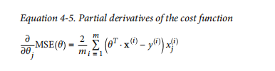

向量形式的偏导公式：

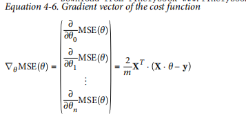

简要介绍了一下 Convergence Rate（收敛速度）。

##### 4.2.2、Stochastic Gradient Descent（随机梯度下降）

Batch Gradient Descent 的主要问题是在每次计算梯度的时候需要使用整个数据集，如果训练数据集很大的话，这个过程将变得很慢很耗时。作为改进，Stochastic Gradient Descent 每次随机挑选一个样本来计算梯度，计算很快（因为每次只使用一个样本来计算），虽然最终得到的参数值是好的，但是不是最优的。

##### 4.2.3、Mini-batch Gradient Descent（小批量梯度下降）

不像是之前的 Batch Gradient Descent（批量梯度下降，每次计算梯度都会使用整个数据集进行计算） 和 Stochastic Gradient Descent（随机梯度下降，每次计算梯度都只使用一个样本进行计算），Mini-batch Gradient Descent （小批量梯度下降）每次只从全部数据集中随机取出一小部分数据集来计算。

Mini-batch Gradient Descent 优于 Stochastic Gradient Descent 的主要优点是，可以从矩阵运算的硬件优化中获得性能提升，尤其是使用 GPU 的时候。

三种梯度下降的比较：

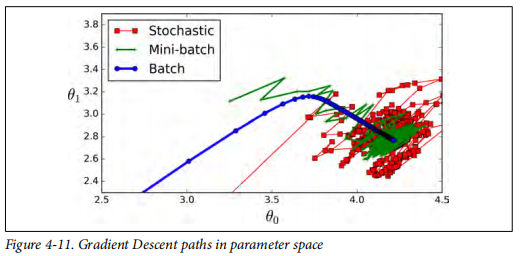

GD 算法与之前介绍的 Linear Regression 算法进行比较

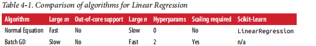

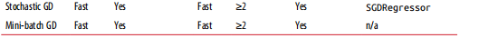

#### 4.3、Polynomial Regression（多项式回归）

使用线性模型拟合非线性数据。一个简单的方法增加每个 feature 的量级作为新特征，然后在这个特征的扩展数据集上训练一个线性模型。这种技术我们称之为 多项式回归。

示例演示生成一些非线性数据，使用 sklearn 的 PolynomialFeatures 类来实现将训练集数据转化为新的特征，然后我们使用 sklearn 的 LinearRegression 方法来拟合新的训练数据集。

#### 4.4、Learning Curves（学习曲线）

了解模型的拟合程度，我们可以使用 交叉验证。如果模型在 training set 上表现很好，而在 test set 上表现很差，那么就有可能出现了过拟合。如果在 training set 和 test set 上都表现得很差，那就是出现了欠拟合。

另一种方法就是 learning curve：

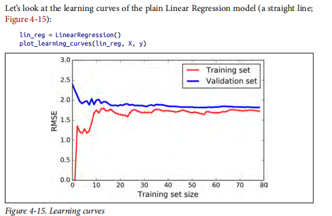

后面介绍了 The Bias/Variance Tradeoff（偏差/方差的权衡）

#### 4.3、Regularized Linear Models（正则化线性模型）

减少过拟合的方法最好的办法是正则化，也就是约束。例如，多项式回归，减少多项式的次数就可以做到约束。对于线性模型，可以约束它的权重。

##### 4.3.1、Ridge Regression

Ridge Regression（也叫作 Tikhonov regularization），它的损失函数为：

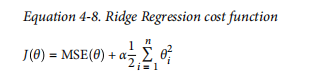

Ridge Regression 求回归系数的等式：

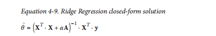

sklearn 中使用如下：from sklearn.linear_model import Ridge

##### 4.3.2、Lasso Regression

全称是 Least Absolute Shrinkage and Selection Operator Regression,它的损失函数为：

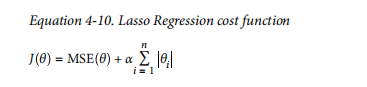

Lasso Regression 求回归系数的等式：

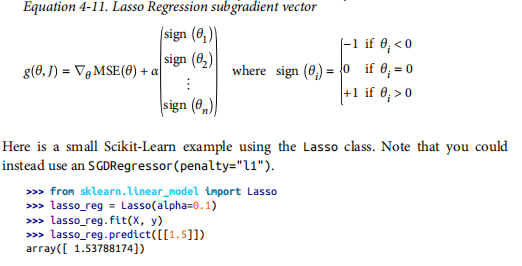

##### 4.3.3、Elastic Net

Elastic Net 是 Ridge Regression 和 Lasso Regression 的中间地带。是 岭回归和 lasso 的简单组合，可以控制混合比率 r 。当 r = 0时，Elastic Net 相当于 岭回归，当 r = 1时，相当于 Lasso 回归。其损失函数为：

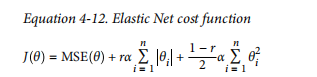

使用 sklearn 调用如下： from sklearn.linear_model import ElasticNet

##### 4.3.4、Early Stopping

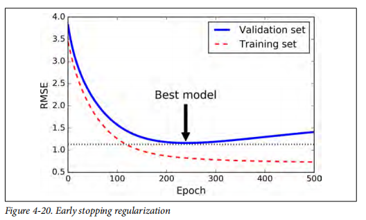

#### 4.4、Logistic Regression

##### 4.4.1、Estimating Probabilities（估计概率）

logistic Regression 的向量形式的：

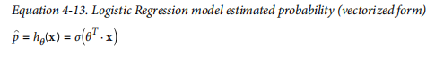

logistic 使用的函数（sigmoid 函数）：

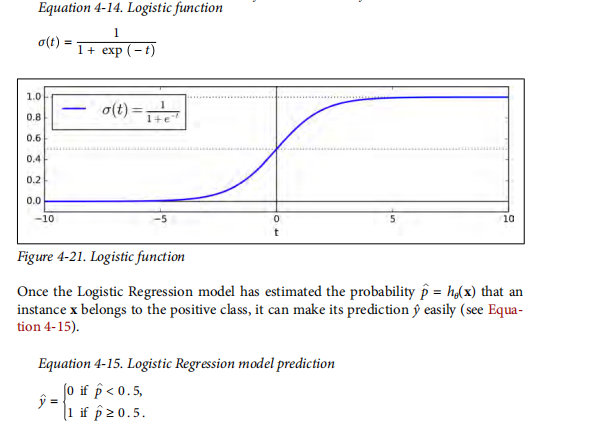

##### 4.4.2、Training and Cost Function（训练和损失函数）

单个训练样本的损失函数：

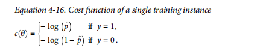

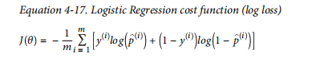

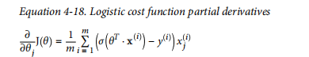

##### 4.4.3、Decision Boundaries（决策边界）

在鸢尾花数据集上查看 Logistic Regression 的决策边界。

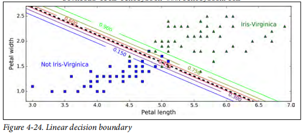

##### 4.4.4、Softmax Regression

Logistic Regression model 可以推广到多分类。这就叫做 Softmax Regression 或者 Multinomial Logistic Regression 。

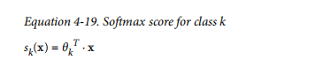

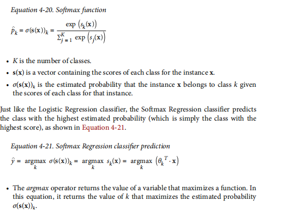

我们会用到交叉熵：

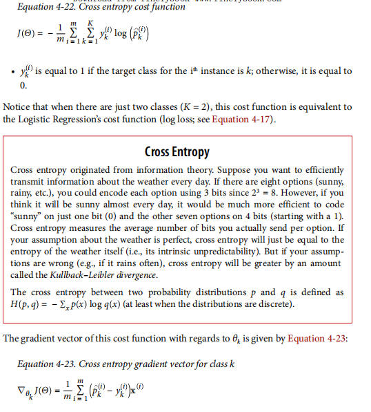

#### 4.5、Exercise

### Chapter 5、Support Vector Machines

#### 5.1、Linear SVM Classification（线性 SVM 分类）

最大间隔分隔：

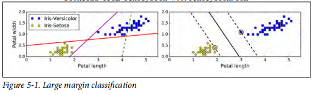

#### 5.2、Nonlinear SVM Classification

#### 5.3、SVM Regression

#### 5.4、Under the Hood

#### 5.5、Exercise

## Part II, Neural Networks and Deep Learning


