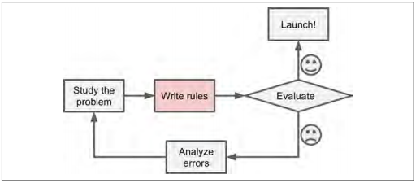
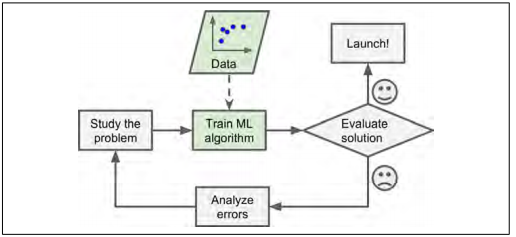
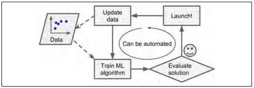

# Part I. 机器学习基础

## Chapter 1.机器学习现状

当大多数人听到 “机器学习” 的时候，他们会描绘一个机器人：一个可靠的管家或者一个致命的终结者，这取决于你所问的对象。 但机器学习不只是一个未来的幻想，它已经体现在了生活中的方方面面。 事实上，在一些专门的应用中，如光学字符识别（OCR）已经有数十年的历史了。 但是，第一个真正成为主流的并改善了数亿人的生活，在 20 世纪 90 年代接管了世界的 ML 应用程序：它是垃圾邮件过滤器。确切上说，它不完全是一个自我认识的天网，但它在技术上符合机器学习（实际上它已经学得很好，你很少需要将邮件标记为垃圾邮件了）。 接下来是数百个 ML 应用程序，现在悄悄地为您经常使用的数百种产品和功能提供支持，比如说，从（搜索或者购物的）更好的建议方面到语音搜索方面，都有了 ML 的涉及。

那么机器学习是从哪儿开始，又到哪儿结束呢？对于一个机器来说，它学习一些东西到底意味着什么呢？如果我下载了一份维基百科的副本，那么是不是我的电脑就真的 “学到” 了一些东西？是不是它突然变聪明了呢？在本章节中，我们将首先介绍什么是机器学习，以及为什么您可能需要使用它。

紧接着，在我们开始探索机器学习大陆之前，我们需要看一下地图，了解一下主要地区和最显著的地标：监督学习和无监督学习，在线与批量学习，基于实例与基于模型学习。然后，我们将看一个典型的 ML 项目的工作流程，讨论您可能面临的主要挑战，以及如何评估和调整机器学习系统。

本章介绍了每个数据科学家应该知道的许多基本概念（和一些行话）。这将是一个高层次的概述（唯一没有太多代码的章节），所以这些都比较简单，但是在继续阅读本书的其余部分之前，您应该确保一切都比较清楚了。所以，拿起一杯咖啡，我们开始吧！

* tips：如果您已经了解了所有的机器学习基础知识，您可以直接跳转到第 2 章。如果您不是那么确定，在跳转之前，尝试回答一下本章最后列出的所有的练习题。

### 机器学习是什么？

机器学习是计算机编程的科学（和艺术），所以这使得计算机可以从数据中学习。

下面给出一个更为广泛的定义：【机器学习是】 不需要一个明确的程序设计，而使得计算机能够学习的一个研究领域。 —— Arthur Samuel, 1959

一个更加面向工程的定义：如果一个计算机在任务 T 上的性能由 P 度量，并且随着经验 E 的提升而提升，那么我们就可以说这个计算机程序在任务 T 上使用 P 度量指标从经验 E 中学习。 —— Tom Mitchell, 1997

例如，您的垃圾邮件过滤器是一个机器学习程序，可以通过给出的垃圾邮件样本（例如，由用户标记）以及常规邮件样本（非垃圾邮件，也称为 "ham"）来学习标记垃圾邮件。系统用来学习的示例样本被称为训练集。每个训练示例被称为训练实例（或样本）。在这种情况下，任务 T 是为新的电子邮件标记垃圾邮件，经验 E 是训练数据，并且需要定义性能度量 P ；例如，您可以使用正确分类的电子邮件的比例。这种特殊的性能度量被称为准确性，经常用于分类任务。

如果您正好下载了一个维基百科的副本，你的电脑有很多的数据，但是在任何任务中都没有表现出突然变好的情况。所以，这个不是机器学习。

### 为什么使用机器学习？

考虑一下如何使用传统的编程技术来编写垃圾邮件过滤器（图 1-1）：

1. 首先你会了解一下垃圾邮件通常是什么样子的。你可能会注意到一些词或短语（比如：“为您”， “信用卡”， “免费” 和 “震惊”）往往会在这个问题上出现很多次。也许你还会注意到发件人姓名，电子邮件正文等其他一些模式。

2. 你会为你注意到的每一个模式写一个检测算法，如果检测到这些模式中的一些，你的程序将会把邮件标记为垃圾邮件。

3. 你会测试你的程序，并重复步骤 1 和步骤 2 ，直到它达到足够好的程度。

  
图1-1. 传统方法

由于这个问题并不是很小，你的程序可能会发展为一个复杂的规则很长的列表 —— 这很难维护。

相比之下，基于机器学习技术的垃圾邮件过滤器通过检测垃圾邮件示例中异常频繁的单词模式，与正常邮件示例（图1-2），自动获悉哪些单词和短语是垃圾邮件的良好预测。这个程序更加短，更加容易维护，而且很可能更加准确。

  
图1-2. 机器学习方法

此外，如果垃圾邮件发送者注意到他们所有包含 “4U” 的电子邮件都被阻止，他们可能会开始使用 “For U” 来替换。使用传统编程技术的垃圾邮件过滤器需要更新以标记 “For U” 电子邮件。如果垃圾邮件发送者继续围绕您的垃圾邮件过滤器工作，那么您需要不断写入新的规则。

相比之下，基于机器学习技术的垃圾邮件过滤器会自动注意到 “For U” 在用户标记的垃圾邮件中变得异常频繁，并且在没有您干预的情况下开始对其进行标记（图 1-3）。

  
图1-3. 自动适应变化

机器学习的另一个大放光芒的领域是针对传统方法过于复杂或者没有已知算法的问题。例如，考虑语音识别：假如你想简单地开始写一个能区分单词 “one” 和 “two” 的程序。你可能会注意到 “two” 这个单词开头是一个高音 （“T”），所以你可以硬编码一个测量高音强度的算法，并用它来区分 “one” 和 “two” 。很明显，这种技术不会在嘈杂的环境和数十种语言中扩展成千上万非常不同的人所说的话。最好的解决方案（至少是现在最好的）是编写一个自学习的算法，给出每个单词的许多示例记录。

最后，机器学习可以帮助人类学系（图 1-4）：可以检查 ML 算法，看看他们已经学到了什么（尽管对于一些算法来说这可能很困难）。例如，一旦垃圾邮件过滤器已经接受足够的垃圾邮件训练，就可以很容易地检查垃圾邮件过滤器是否能够预测垃圾邮件的最佳预测效果。有时候，这将揭示出未知的相关性或新的趋势，从而导致对问题有更好的理解。应用 ML 技术挖掘大量的数据可以帮助发现那些并不明显的模式。这被称为数据挖掘。