# Part I. 机器学习基础

## Chapter 1.机器学习现状

当大多数人听到 “机器学习” 的时候，他们会描绘一个机器人：一个可靠的管家或者一个致命的终结者，这取决于你所问的对象。 但机器学习不只是一个未来的幻想，它已经体现在了生活中的方方面面。 事实上，在一些专门的应用中，如光学字符识别（OCR）已经有数十年的历史了。 但是，第一个真正成为主流的并改善了数亿人的生活，在 20 世纪 90 年代接管了世界的 ML 应用程序：它是垃圾邮件过滤器。确切上说，它不完全是一个自我认识的天网，但它在技术上符合机器学习（实际上它已经学得很好，你很少需要将邮件标记为垃圾邮件了）。 接下来是数百个 ML 应用程序，现在悄悄地为您经常使用的数百种产品和功能提供支持，比如说，从（搜索或者购物的）更好的建议方面到语音搜索方面，都有了 ML 的涉及。

那么机器学习是从哪儿开始，又到哪儿结束呢？对于一个机器来说，它学习一些东西到底意味着什么呢？如果我下载了一份维基百科的副本，那么是不是我的电脑就真的 “学到” 了一些东西？是不是它突然变聪明了呢？在本章节中，我们将首先介绍什么是机器学习，以及为什么您可能需要使用它。

紧接着，在我们开始探索机器学习大陆之前，我们需要看一下地图，了解一下主要地区和最显著的地标：监督学习和无监督学习，在线与批量学习，基于实例与基于模型学习。然后，我们将看一个典型的 ML 项目的工作流程，讨论您可能面临的主要挑战，以及如何评估和调整机器学习系统。

本章介绍了每个数据科学家应该知道的许多基本概念（和一些行话）。这将是一个高层次的概述（唯一没有太多代码的章节），所以这些都比较简单，但是在继续阅读本书的其余部分之前，您应该确保一切都比较清楚了。所以，拿起一杯咖啡，我们开始吧！

* tips：如果您已经了解了所有的机器学习基础知识，您可以直接跳转到第 2 章。如果您不是那么确定，在跳转之前，尝试回答一下本章最后列出的所有的练习题。

### 1、机器学习是什么？

机器学习是计算机编程的科学（和艺术），所以这使得计算机可以从数据中学习。

下面给出一个更为广泛的定义：【机器学习是】 不需要一个明确的程序设计，而使得计算机能够学习的一个研究领域。 —— Arthur Samuel, 1959

一个更加面向工程的定义：如果一个计算机在任务 T 上的性能由 P 度量，并且随着经验 E 的提升而提升，那么我们就可以说这个计算机程序在任务 T 上使用 P 度量指标从经验 E 中学习。 —— Tom Mitchell, 1997

例如，您的垃圾邮件过滤器是一个机器学习程序，可以通过给出的垃圾邮件样本（例如，由用户标记）以及常规邮件样本（非垃圾邮件，也称为 "ham"）来学习标记垃圾邮件。系统用来学习的示例样本被称为训练集。每个训练示例被称为训练实例（或样本）。在这种情况下，任务 T 是为新的电子邮件标记垃圾邮件，经验 E 是训练数据，并且需要定义性能度量 P ；例如，您可以使用正确分类的电子邮件的比例。这种特殊的性能度量被称为准确性，经常用于分类任务。

如果您正好下载了一个维基百科的副本，你的电脑有很多的数据，但是在任何任务中都没有表现出突然变好的情况。所以，这个不是机器学习。


### 2、为什么使用机器学习？

考虑一下如何使用传统的编程技术来编写垃圾邮件过滤器（图 1-1）：

1. 首先你会了解一下垃圾邮件通常是什么样子的。你可能会注意到一些词或短语（比如：“为您”， “信用卡”， “免费” 和 “震惊”）往往会在这个问题上出现很多次。也许你还会注意到发件人姓名，电子邮件正文等其他一些模式。

2. 你会为你注意到的每一个模式写一个检测算法，如果检测到这些模式中的一些，你的程序将会把邮件标记为垃圾邮件。

3. 你会测试你的程序，并重复步骤 1 和步骤 2 ，直到它达到足够好的程度。

  
图1-1. 传统方法

由于这个问题并不是很小，你的程序可能会发展为一个复杂的规则很长的列表 —— 这很难维护。

相比之下，基于机器学习技术的垃圾邮件过滤器通过检测垃圾邮件示例中异常频繁的单词模式，与正常邮件示例（图1-2），自动获悉哪些单词和短语是垃圾邮件的良好预测。这个程序更加短，更加容易维护，而且很可能更加准确。

  
图1-2. 机器学习方法

此外，如果垃圾邮件发送者注意到他们所有包含 “4U” 的电子邮件都被阻止，他们可能会开始使用 “For U” 来替换。使用传统编程技术的垃圾邮件过滤器需要更新以标记 “For U” 电子邮件。如果垃圾邮件发送者继续围绕您的垃圾邮件过滤器工作，那么您需要不断写入新的规则。

相比之下，基于机器学习技术的垃圾邮件过滤器会自动注意到 “For U” 在用户标记的垃圾邮件中变得异常频繁，并且在没有您干预的情况下开始对其进行标记（图 1-3）。

  
图1-3. 自动适应变化

机器学习的另一个大放光芒的领域是针对传统方法过于复杂或者没有已知算法的问题。例如，考虑语音识别：假如你想简单地开始写一个能区分单词 “one” 和 “two” 的程序。你可能会注意到 “two” 这个单词开头是一个高音 （“T”），所以你可以硬编码一个测量高音强度的算法，并用它来区分 “one” 和 “two” 。很明显，这种技术不会在嘈杂的环境和数十种语言中扩展成千上万非常不同的人所说的话。最好的解决方案（至少是现在最好的）是编写一个自学习的算法，给出每个单词的许多示例记录。

最后，机器学习可以帮助人类学系（图 1-4）：可以检查 ML 算法，看看他们已经学到了什么（尽管对于一些算法来说这可能很困难）。例如，一旦垃圾邮件过滤器已经接受足够的垃圾邮件训练，就可以很容易地检查垃圾邮件过滤器是否能够预测垃圾邮件的最佳预测效果。有时候，这将揭示出未知的相关性或新的趋势，从而导致对问题有更好的理解。应用 ML 技术挖掘大量的数据可以帮助发现那些并不明显的模式。这被称为数据挖掘。

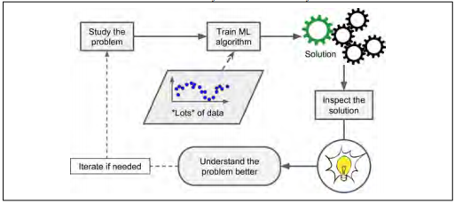  
图1-4. 机器学习可以帮助人类学习

总而言之，机器学习对于以下的问题都有较好的表现：

 - 现有解决方案需要大量手动调整或长规则列表的问题：一种机器学习算法通常可以简化代码并且得到更好的效果。

 - 使用传统的方法没有好的解决方案的复杂的问题：最好的机器学习技术可以找到一个解决方案。

 - 不是很稳定，时常波动的环境：机器学习系统可以适应新的数据。

 - 需要深入了解复杂的问题和数据量比较大的问题。

 ### 3、机器学习系统的类型

 有很多不同类型的机器学习系统，根据下面的类别对它们进行分类是非常有用的：

 - 它们是否接受人工监督（有监督，无监督，半监督和强化学习）

 - 它们是否可以即时增量学习（在线 vs 批量学习）

 - 无论它们是通过将新数据点与已知数据点进行简单比较，还是像科学家一样，检测训练数据中的模式并构建预测模型（基于实例的学习 与 基于模型的学习）

 这些标准不是唯一的；你可以用任何你喜欢的方式把它们组合起来。例如，一个最先进的垃圾邮件过滤器可以使用通过垃圾邮件和常规邮件的例子进行训练的神经网络模型进行实时学习；这使得它成为一个在线的，基于模型的监督式学习系统。
 
 接下来，让我们来深入了解一下这些标准。

 #### 3.1、有监督/无监督 学习

 机器学习系统可根据他们在训练期间获得的监督（有 label 的样本）的数量和类型进行分类。有四个主要类别：监督学习，无监督学习，半监督学习和强化学习。

 ##### 3.1.1、监督学习

 在监督学习中，您提供给算法的训练数据包括所需的解决方案，称为 labels（标签）（图 1-5）

 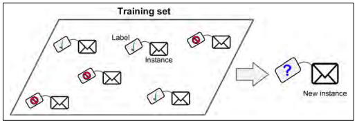  
图1-5. 有监督学习的标记训练集（例如，垃圾邮件分类）

典型的监督学习任务是分类。垃圾邮件过滤器就是一个很好的例子：它是与许多示例电子邮件和它们的类（垃圾邮件和常规邮件）一起训练，并且它必须学会如何分类新的电子邮件。

另一个典型的任务是预测一个目标数值，如给定一组特征（里程，年限，品牌等），来预测一辆汽车的价格，称为预测。这种任务被称为回归（图 1-6）。为了训练这个系统，你需要给出很多汽车的样本，包括他们的预测指标（前面提到的特征）和对应的 label（即它们的价格）。

* Tips：有趣的是，“回归”这个奇怪的名字是 Francis Galton 在研究高个子父母的孩子往往比父母要矮的事实时所引入的统计学术语。由于孩子较矮，他把这种回归称为平均。然后将这个名称应用于他用来分析变量之间相关性的方法。

* Tips：在机器学习中，属性是数据类型（例如，“里程”），而特征取决于上下文具有多个含义，但通常意味着属性加上其值（例如，“里程 = 15000”）。尽管如此，许多人可以互换地使用单词属性和特征。

 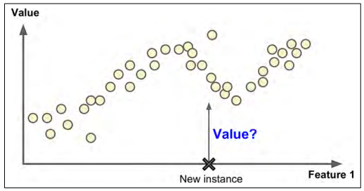  
图1-6. 回归

请注意，一些回归算法也可以用于分类，反之亦然。例如，Logistic 回归通常用于分类，因为它可以输出与属于给定类别的可能性相对应的值（例如，20% 的可能性是垃圾邮件）。

下面列出了一些最重要的监督学习算法（本书所涵盖）：

 - k-Nearest Neighbors（k近邻）
 - Linear Regression（线性回归）
 - Logistic Regression（Logistic 回归）
 - Support Vector Machines (SVMs)（支持向量机）
 - Decision Trees and Random Forests（决策树和随机森林）
 - Neural network（神经网络）

Tips：一些神经网络架构可以是无监督的，比如自动编码器和受限制的玻尔兹曼机。他们也可以是半监督的，比如深度信仰网络和无监督的预训练。

##### 3.1.2、无监督学习

在无监督学习，你可能会猜到，训练数据是没有标签的（图 1-7）。该系统试图在没有人工监督的情况下进行学习。

   
图1-7. 一个无标记的训练集用于无监督学习

下面介绍一些最重要的无监督学习算法（我们将在第 8 章介绍降维）：

 - 聚类
    - k-Means
    - Hierarchical Cluster Analysis (HCA)（分层聚类分析）
    - Expectation Maximization（期望最大化）

 - 可视化和降维
    - Principal Component Analysis (PCA)（主成分分析）
    - Kernel PCA— Locally-Linear Embedding (LLE)（内核 PCA - 局部线性嵌入）
    - t-distributed Stochastic Neighbor Embedding (t-SNE)（t 分布的随机相邻嵌入）

 - 关联规则学习
    - Apriori
    - Eclat

例如，假设您有大量关于博客访问者的数据。您可能需要运行一个聚类算法来尝试检测相似访问者组（图 1-8）。你不需要告知算法博客访问者属于哪个组：它发现这里没有你的帮助。例如，可能会注意到，有 40% 的访问者是喜欢漫画的男性，一般在晚上阅读您的博客， 20% 是周末访问的年轻科幻爱好者，等等。如果使用层次聚类算法，那么也可以将每个组细分为更小的组。这可能会帮助您定位每个组的类别。

 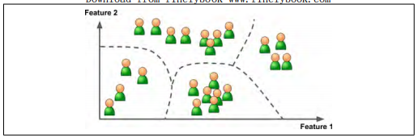  
图1-8. 聚类

可视化算法也是无监督学习算法的一个好例子：您向它们提供大量复杂和未标记的数据，并输出数据的 2D 或 3D 表示形式（图 1-9）。这些算法试图保留尽可能多的结构（例如，试图在输入空间中保持独立的聚类在可视化中不重叠），这样就可以理解数据是如何组织的，并且可能识别不确定的模式。

 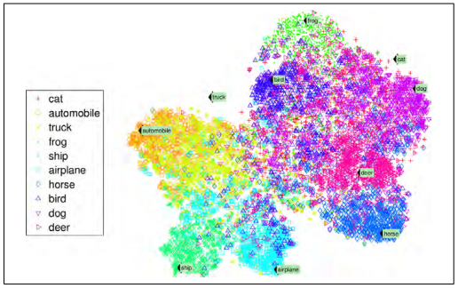  
图1-9. 突显语义聚类的 t-SNE 可视化示例

 - Tips：注意一下动物与车辆的分离程度，马距离鹿比较近但是距离鸟比较远等等。经过 Socher, Ganjoo, Manning, and Ng (2013) 的许可转载，“T-SNE visualization of the semantic word space.” 

一个相关的任务是降维，其目标是简化数据而不会丢失太多的信息。一种方法是将几个相关的特征合并为一个。例如，汽车的里程数可能与其年限非常有关系，因此降维算法将把它们合并成一个代表汽车磨损的特征。这被称为特征提取。

在将其提供给另一个机器学习算法（如监督学习算法）之前，尝试使用降维算法来减少训练数据的维数通常是一个好主意。它将运行得更快，数据将占用更少的磁盘和内存空间，在某些情况下，性能可能会更好。

另一个重要的无监督任务是异常检测 —— 例如，检测异常信用卡交易以防止欺诈，捕捉制造缺陷，或者在将数据提供给另一个学习算法之前自动移除离群值。系统是用正常的实例训练的，当它看到一个新的实例时，它可以告诉它是否看起来像一个正常的实例，或者是否可能是一个异常（见图 1-10）。

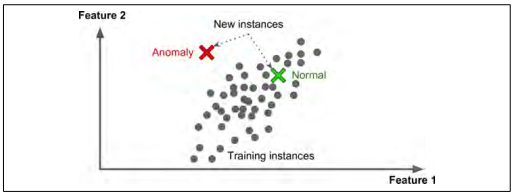  
图1-10. 异常值检测

最后，另一个常见的无监督任务是关联规则学习，其目的是挖掘大量数据并发现属性之间的有趣关系。例如，假如你拥有一家超市。在销售日志上运行关联规则可能会发现购买烧烤酱和薯片的人也倾向于购买牛排。因此，您可能希望将这些物品放在一起。

##### 3.1.3、半监督学习

一些算法可以处理部分标记的训练数据，通常是很多未标记的数据和一些标记的数据。这被称为半监督学习（图 1-11）。

一些照片托管服务，例如 Google 照片就是很好的例子。一旦您将所有家庭照片上传到服务中，它会自动识别出同一个人 A 出现在照片 1,5 和 11 中，而另一个人 B 出现在照片 2,5 和 7 中。这是算法的无监督部分（聚类）。现在所有的系统需求都是为了告诉你这些人是谁。每个人只有一个标签，并且能够在每张照片中命名每个人，这对于搜索照片是有用的。

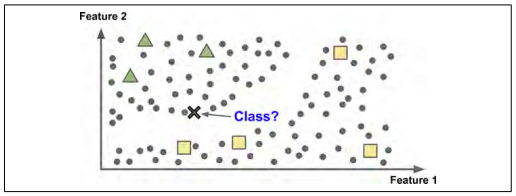  
图1-11. 半监督学习

大多数半监督学习算法是无监督和监督算法的组合。例如， deep belief networks (DBNs)（深度信念网络）基于被称为 restricted Boltzmann machines (RBMs)（受限玻尔兹曼机）的无监督组件。以无监督的方式按顺序训练 RBM ，然后使用监督学习技术对整个系统进行微调。

* 每个人只有一个标签，那是系统完美运行的时候。在实践中，每个人往往会创建几个聚类，有时会混合两个看起来相似的人，所以您需要为每个人提供一些标签并手动清理某些聚类簇。

##### 3.1.4、强化学习

强化学习是一个非常不同的黑马。在这种情况下，被称为 agent 的学习系统可以观察环境，选择和执行行动，并获取回报（或负面回报的惩罚，如图 1-12）。然后，它必须自己学习什么是最好的策略，称为 policy ，以获取最大的回报。一项 policy 规定了 agent 在特定情况下应该选择的行动。

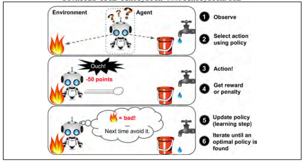  
图1-12. 强化学习

例如，许多机器人使用强化学习算法来学习如何走路。DeepMind 的 AlphaGo 程序也是强化学习的一个很好的例子：它在 2016 年 3 月成为头条新闻，当时它在 Go 的比赛中击败了世界冠军 Lee Sedol 。它通过分析数以百万计的游戏来学习它的获胜 policy ，然后与自己玩很多游戏。请注意，在对抗冠军的比赛中，学习被关闭； AlphaGo 只是应用了它所学的 policy 。


#### 3.2、批量和在线学习

用来对机器学习系统进行分类的另一个标准是系统是否可以从输入数据流中递增的学习。

##### 3.2.1、批量学习

在批量学习中，系统无法增量学习：必须使用所有可用的数据进行训练。这通常会花费大量的时间和计算资源，所以通常是离线的。首先，系统经过训练，然后投入生产，不再学习；它只是应用了它学到的东西。这就是所谓的离线学习。

如果您希望批量学习系统去了解新数据（例如新型垃圾邮件），则需要在整个数据集上从头开始训练新版本的系统（不仅包括新数据，还包括旧数据），然后停止旧的系统，并用新的替换它。

幸运的是，训练，评估和启动机器学习系统的整个过程可以很容易地自动化（如图 1-13 所示），所以即使是批量学习系统也能适应变化。只需根据需要随时更新数据并从头开始训练新版本的系统。

这个解决方案很简单，通常工作正常，但使用全套数据进行训练可能需要很多小时，所以通常每 24 小时甚至每周训练一个新系统。如果您的系统需要适应快速变化的数据（例如预测股票价格），那么您需要一个更为反应迅速的解决方案。

而且，对整套数据进行训练需要大量的计算资源（CPU，内存空间，磁盘空间，磁盘 I/O， 网络 I/O 等）。如果你有大量的数据，而且你的系统每天都从头开始自动化，那么最终会花费你很多钱。如果数据量很大，甚至可能不可能使用批量学习算法。

最后，如果你的系统需要自主学习，资源有限（如 Mars 上的智能手机应用程序或漫游者），那么随身携带大量的训练数据，占用大量资源，每天训练几个小时就是一个不争的事实。

幸运的是，在所有这些情况下，更好的选择是使用能够增量学习的算法。

##### 3.2.2、在线学习

在在线学习中，通过按顺序向数据实例提供数据，逐个地或通过称为小批量的小组对其进行训练。每个学习步骤都快速且便宜，因此系统可以实时地从新数据中学习（见图 1-13）。

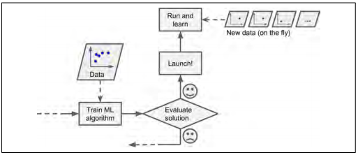  
图1-13. 在线学习

在线学习对于以连续流（例如股票价格）接收数据并需要适应快速或自主变化的系统而言是非常好的。如果您拥有有限的计算资源，这也是一个不错的选择：一旦在线学习系统学习了新的数据实例，就不再需要它们了，所以您可以放弃它们（除非您希望能够回滚到之前状态和“重放”数据）。这可以节省大量的空间。

在线学习算法也可以用来训练大型数据集上的系统，这些数据集不能放在一台机器的主内存中（这被称为核外学习）。该算法加载部分数据，对该数据运行训练步骤，并重复该过程，直到它运行在所有的数据上（请参见 图 1-14）。

* 整个过程通常是离线的（即不是在线系统），所以在线学习可能是一个令人困惑的名字。把它当成渐进式学习。

  
图1-14. 使用在线学习处理大型数据集

在线学习系统的一个重要参数是他们应该多快适应变化的数据：这就是所谓的学习率。 如果您设置了高学习率，那么您的系统将快速适应新的数据，但它也往往会快速忘记旧数据（您不希望垃圾邮件过滤器只标记它显示的最新类型的垃圾邮件） 相反，如果你设定的学习率很低，系统会有更多的惯性; 也就是说，它会学得更慢，但是它对新数据中的噪声或者非代表性数据点的序列也不那么敏感。

在线学习的一大挑战是，如果系统中有糟糕的数据，系统的性能会逐渐下降。 如果我们正在谈论一个在线系统，您的客户端会注意到这种情况。 例如，糟糕的数据可能来自机器人上的故障传感器，或来自发布垃圾邮件的人试图搜索引擎中使垃圾邮件在搜索结果中排名靠前。 为了降低这种风险，您需要密切监视您的系统，如果您发现系统的性能下降，应该立即关闭学习（并尽可能恢复到之前的工作状态）。 您可能还需要监视输入数据并对异常数据作出反应（例如，使用异常检测算法）。

#### 3.3、基于实例 vs 基于模型 学习

机器学习系统的另一种分类方法是如何进行泛化。最重要的机器学习任务是关于预测。这就意味着，通过一些训练实例，系统需要能够泛化到以前从未见过的示实例。在训练数据上有良好的效果评估是很好的，但是单纯这样是不够的；真正的目标是在新的数据实例上表现良好。

泛化有两种主要方法：基于实例的学习和基于模型的学习。

##### 3.3.1、基于实例的学习

可能最琐碎的学习形式就是单纯的用心学习。如果以这种方式方式创建垃圾邮件过滤器，则只会标记所有与用户已标记的电子邮件相同的电子邮件，这虽然不是最差的解决方案，但肯定不是最好的。

您可以将垃圾邮件过滤器编程为标记与已知垃圾邮件非常相似的电子邮件，而不仅仅标记与已知垃圾邮件相同的电子邮件。 这需要两个电子邮件之间的相似程度。 两个电子邮件之间的（非常基本的）相似性度量可以是统计它们具有的共同字数。 如果电子邮件与已知的垃圾邮件有许多共同之处，系统就会将其标记为垃圾邮件。

这被称为基于实例的学习：系统用心学习示例，然后使用相似性度量推广到新的实例（图 1-15）。

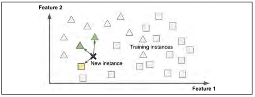  
图1-15. 基于实例的学习

##### 3.3.2、基于模型的学习

另一种从一组实例中泛化的方法是构建拟合这些实例的模型，然后使用该模型进行预测。这就是所谓的基于模型的学习（图 1-16）。

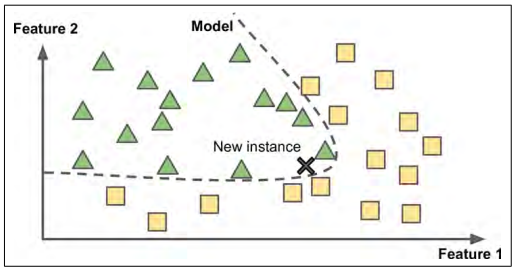  
图1-16. 基于模型的学习

例如，假设您想知道金钱是否让人开心，那么您可以从 [OECD 网站](https://goo.gl/0Eht9W) 上下载 Better Life Index 数据，以及从 [IMF 网站](http://goo.gl/j1MSKe) 上下载有关人均 GDP 的统计数据。然后你会得到表格，按人均 GDP 排序。表 1-1 显示了您所得到的摘录。

表1-1 金钱能使人感到更加幸福吗？  
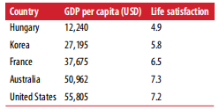

我们来绘制一些随机国家的数据（图 1-17）。

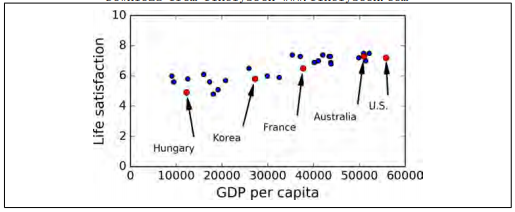  
图1-17. 你能看出这里的趋势吗？

这里似乎有一种趋势！尽管数据是嘈杂的（即部分是随机的），但随着国家人均 GDP 的增长，生活满意度似乎也呈线性增长。所以你决定把生活满意度建模为人均 GDP 的线性函数。这一步被称为模型选择：你选择了一个只有一个属性人均 GDP（方程 1-1）的生活满意度的线性模型。

等式1-1 一个简单的线性模型  
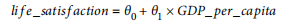

这个模型有两个模型参数 θ0 和 θ1 ，通过调整这些参数，可以使模型表示任何线性函数，如图 1-18 所示。

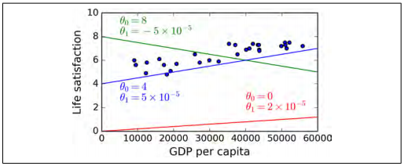  
图1-18. 一些可能的线性模型

在使用模型之前，您需要定义参数值 θ0 和 θ1 。如何知道哪些值将使您的模型表现最佳？要回答这个问题，您需要指定一个性能指标。你可以定义一个效用函数（或者拟合函数）来衡量你的模型是多么的好，或者你可以定义一个衡量它有多糟糕的成本函数。对于线性回归问题，人们通常使用成本函数来度量线性模型预测与训练样例之间的距离；目的是最小化这个距离。

这就是线性回归算法的来源：你给它提供训练样本，并找到使线性模型最适合你的数据的参数。这叫做训练模型。在我们的例子中，算法发现最佳参数值是 θ0 = 4.85 和 θ1 = (4.91×10)^(-5) 。

现在，模型尽可能接近训练数据（对于线性模型），如图 1-19 所示。

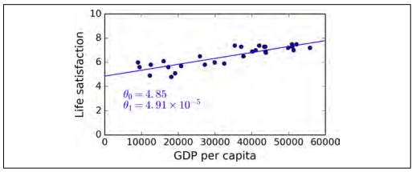  
图1-19. 拟合线性数据最好的线性模型

你终于准备好运行模型做出预测了。 例如，假设你想知道塞浦路斯人是多么幸福，而且 OECD 的数据也没有答案。幸运的是，你可以用你的模型做一个很好的预测：你查查塞浦路斯人均 GDP，找到 22,587 美元，然后应用你的模型，发现生活满意度可能在 4.85 + 22,587×4.91×10^(-5) = 5.96 左右。

为了让你更加感兴趣，例 1-1 展示了加载数据，准备数据，创建可视化散点图的 Python 代码，然后训练线性模型并进行预测。

例 1-1、使用 scikit-learn 训练和运行线性模型

```python
import matplotlib
import matplotlib.pyplot as plt
import numpy as np
import pandas as pd
import sklearn

# Load the data
oecd_bli = pd.read_csv("oecd_bli_2015.csv", thousands=',')
gdp_per_capita = pd.read_csv("gdp_per_capita.csv",thousands=',',delimiter='\t', encoding='latin1', na_values="n/a")

# Prepare the data
country_stats = prepare_country_stats(oecd_bli, gdp_per_capita)
X = np.c_[country_stats["GDP per capita"]]
y = np.c_[country_stats["Life satisfaction"]]

# Visualize the data
country_stats.plot(kind='scatter', x="GDP per capita", y='Life satisfaction')
plt.show()

# Select a linear model
lin_reg_model = sklearn.linear_model.LinearRegression()

# Train the model
lin_reg_model.fit(X, y)

# Make a prediction for Cyprus
X_new = [[22587]] # Cyprus' GDP per capita
print(lin_reg_model.predict(X_new)) # outputs [[ 5.96242338]]
```

* Tips：如果您使用了基于实例的学习算法，那么您会发现斯洛文尼亚的人均 GDP 接近塞浦路斯的 （ $20,732 ），由于 OECD 数据告诉我们斯洛文尼亚人的生活满意度是 5.7 ，预测塞浦路斯的生活满意度为 5.7 。如果缩小一点，看看最近的两个国家，你会发现葡萄牙和西班牙的生活满意度分别为 5.1 和 6.5 。去这三个值的平均值，你得到 5.77 ，这是非常接近你的基于模型的预测。这个简单的算法被称为 k-近邻 回归（在这个例子中，k=3）。在前面的代码中用 k-近邻回归替代线性回归模型，就像下面替换一行代码这样简单：

```python
clf = sklearn.linear_model.LinearRegression()
```
用下面的这一行替换：

```python
clf = sklearn.neighbors.KNeighborsRegressor(n_neighbors=3)
```

如果一切顺利，你的模型将会做出很好的预测。如果不是，则可能需要使用更多属性（就业率，健康状况，空气污染等），获得更多或更好的质量训练数据，或者选择更强大的模型（例如多项式回归模型）。

综上所述：

 - 您研究了数据。
 - 您选择了一个模型。
 - 您在训练数据上训练它（即，学习算法搜索使成本函数最小化的模型参数值）。
 - 最后，你应用这个模型对新的案例进行预测（这就是所谓的推理），希望这个模型能够很好地推广。

这是典型的机器学习项目的样子。在第二章中，您将通过一个端到端的项目来亲身体验这一点。

到目前为止，我们已经介绍了很多基础知识：现在您已经了解了机器学习的真正意义，为什么它是有用的，最常见的 ML 系统是什么，以及典型的项目工作流程。现在让我们来看看学习中会出现什么问题，并阻止你做出准确的预测。

### 4、机器学习的主要挑战

简而言之，由于你的主要任务是选择一个学习算法，并在一些数据上进行训练，所以可能出现的问题是 “坏算法” 和 “坏数据” 。让我们从坏数据的例子开始。

#### 4.1、训练数据量不足

对于一个学习苹果的孩子来说，只需要指向一个苹果并说出这个是 “苹果” （可能重复这个过程几次）。现在孩子能够识别各种颜色和形状的苹果。天才。

机器学习还不够，大多数机器学习算法需要很多数据才能正常工作。即使对于非常简单的问题，您通常也需要数千个示例，而对于图像或者语音识别等复杂问题，您可能需要数百万个示例（除非您可以重新使用现有模型的某些部分）。

##### 4.1.1、数据的不合理有效性

在 2001 年出版的一篇 [著名论文](http://goo.gl/R5enIE) 中，微软研究人员 Michele Banko 和 Eric Brill 指出，一旦获得了足够的数据，一个非常复杂的自然语言歧义问题就会表现出非常不同的机器学习算法（见图 1-20）。

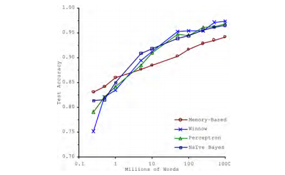  
图1-20. 数据与算法的重要性

正如作者所说的那样：“这些结果表明我们可能想重新考虑在算法开发上花费时间和金钱之间的权衡，还是花在语料库开发上。”

Peter Norvig 等人进一步推广了数据比复杂问题更重要的思想。在 2009 年发表的一篇题为 “数据的不合理有效性” 的论文中。但是，应该指出的是，中小型数据集仍然非常普遍，获得额外的训练数据并不总是很容易或便宜，所以不要放弃算法。

#### 4.2、没有代表性的训练数据

为了推广地更好，你的训练数据代表你想要推广的新的案例是至关重要的。无论您使用基于实例的学习还是基于模型的学习，情况都是如此。

例如，我们之前用来训练线性模型的一组国家并不完全具有代表性，有几个国家是缺失的。图 1-21 显示了添加缺失国家的数据。

  
图1-21. 更具有代表性的数据

如果你在这个数据上训练一个线性模型，你会得到实线，而旧模型用虚线表示。 正如你所看到的，不仅增加了一些缺失的国家，大大改变了模型，但它清楚地表明，这样一个简单的线性模型可能永远不会工作。 似乎很富裕的国家比中等富裕的国家（事实上它们看起来不幸福）不快乐，相反，一些穷国似乎比许多富裕国家更幸福。

通过使用没有代表性训练集，我们训练了一个不太可能做出准确预测的模型，特别是对于非常贫穷和非常富裕的国家。

使用一个代表您想要推广的案例的训练集是至关重要的。这往往比听起来难：如果样本太小，就会产生抽样噪声（即偶然出现的非代表性数据作为结果），但是如果抽样方法有缺陷，即使是非常大的样本也可能不具备代表性。这就是所谓的抽样偏差。

##### 4.2.1、取样偏差的一个著名的例子

也许最有名的抽样偏差的例子发生在 1936年的美国总统选举期间，使得兰登反对罗斯福：“文学文摘” 进行了一项非常大的民意调查，向大约 1000 万人发送邮件。它得到了 240 个回复，并高度自信地预测 兰登会得到 57% 的选票。正好相反，罗斯福获得了 62% 的选票。这个缺陷是文学文摘的抽样方法：

 - 第一，要获得发送投票的地址，文学文摘要使用电话簿，杂志订阅用户名单，俱乐部会员名单和类似的人。所有这些名单往往有利于富裕的人，这些人更可能投共和党（因此会投兰登）。

 - 第二，只有不到 25% 的人接受了选票。再一次，这引起了抽样偏差，排除了那些不太关心的政治的人，不喜欢 “文学文摘” 的人和其他重要的群体。这是一种特殊类型的抽样偏差，称为无代表性偏差。

 下面还有另外一个例子：假设你想建立一个系统来识别 funk 音乐视频。创建你的训练集的一种方法是在 Youtube 上搜索 “funk music” ，并使用结果的视频。但是，这里假设 Youtube 的搜索引擎会返回一组代表 Youtube 上所有 funk 音乐视频的视频。实际上，搜索结果可能会偏向流行的艺术家（如果你住在巴西，你会得到很多 “funk carioca” 的视频，这听起来不像詹姆斯·布朗）。另一方面，你还可以得到一个大的训练数据集？

 